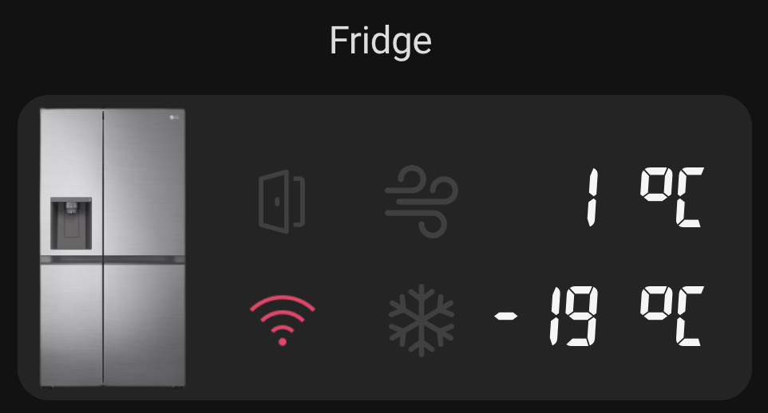

This repo is for Home Assistant users who want cards that look like their LG ThinQ enabled machines physical displays. You'll need the LG ThinQ integration already installed.

This repo contains cards designed for the following device types:
LG Washer
LG Dryer
LG Combo Washer/Dryer
LG Mini-Washer
LG Dishwasher
LG Fridge

Known supported/tested models:
MiniWasher: WTP20WY
Combo Washer/Dryer:
Dish Washer: XD3A25BS, DFB425FP
Fridge: GC-L257SLXL

This is expected to apply pretty widely to any/all LG ThinQ devices of these types, regardless of model. The implementation from the ThinQ integration is quite standardised, so most washer/dryer or combo machines should work, and the same for Dishwashers. 

# Installation (manual)
1. Where `config` is the location of your `configuration.yaml` file, create `config/www` if it does not already exist. Then place the contents from this repository's `config/www` into yours.
If you don't plan to user all the machine types, you can leave out the images that you don't require.
2. On your Lovelace dashboard, click the three dots in the top right, and select `Edit Dashboard`. Now click the three dots again, and click `Manage Resources` (if you don't have this option, click your User on the sidebar and enable Advanced Mode). Tap `Add Resource` in the bottom right, then enter `/local/7segment.css` and ensure the type is set to `Stylesheet`. Complete the entry.
3. Add the contents of this repository's `configuration.yaml` to your own. If you already have a template sensors entry like this, these sensors can be added alongside your other template sensors.
4. **Important:** rename `sensor.washer` to the entity ID of your LG Washer, `sensor.washer_run_state` to the corresponding Washer Run State sensor, `sensor.dryer` to your dryer, and `sensor.dryer_run_state` to the Dryer Run State sensor. (In the configuration as well as the cards themselves)
**Fridge rename:** In the fridge card configuration rename the following to your sensors and switches: `switch.refrigerator_express_fridge`, `switch.refrigerator_express_mode`, `sensor.refrigerator`, `binary_sensor.refrigerator_door_open`, `sensor.refrigerator_fridge_temp`, `sensor.refrigerator_freezer_temp`.
**Note**: The config file contains sensors for multiple LG machines (Washer, Dryer, Dishwasher, etc.) -- Remove the entries you do not need.
5. Restart Home Assistant for the changes to `configuration.yaml` to take effect. Confirm the entities created in that config exist now by searching under Entities. 
5. Now go to your desired Lovelace dashboard, go to `Edit Dashboard`, and add a Vertical Stack card. Enter the Code Editor and paste in the contents of the device card YAML file you are wishing to implement.
`washer-card.yaml`, `dryer-card.yaml`, `washercombo-card.yaml`, `dishwasher.yaml`, `miniwasher-card.yaml`, `fridge.yaml`
6. _Optional:_ as written, these cards show a list of settings (temperature, cycle, etc.) underneath when the washer/dryer is running. If you don't want that, just remove the conditional card from the stack, or take the washer/dryer Picture Elements card out of the stack entirely and place it as its own card.

# Notes
7segment font (c) Jan Bobrowski (OFL) - http://torinak.com/7segment
